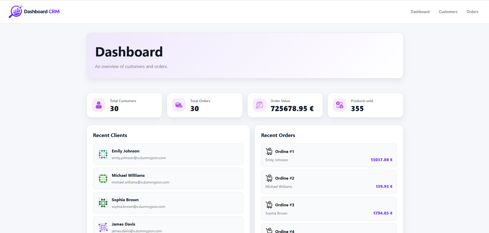

# CRM Dashboard

CRM Dashboard built with React, TypeScript and React Router.

🌐 Live Demo: https://friendly-hamster-cd0697.netlify.app/

---

## Overview

CRM Dashboard is a responsive frontend application designed to manage customers and orders through a clean and modern interface.

The project uses real API data and includes customer management, order tracking, dynamic routing, URL filters, reusable components and responsive layouts.

---

## Features

- Dashboard with key statistics
- Recent customers section
- Recent orders section
- Customers list
- Customer detail page
- Orders list
- Customer → Orders relationship
- Search and sorting with URL Search Params
- Loading and error states
- Responsive design
- Real API integration
- React Router navigation

---

## Tech Stack

- React
- TypeScript
- Vite
- React Router
- Fetch API
- CSS

---

## API

Data is fetched from:

- DummyJSON Users API
- DummyJSON Carts API

---

## Installation

```bash
npm install
npm run dev
```

## Build

```bash
npm run build
```

---

## Screenshots

### Dashboard



### Customers


### Orders


---

## Project Structure

```txt
src
├── components
├── features
│   ├── customers
│   ├── orders
│   └── dashboard
├── pages
├── services
├── hooks
└── types
```

---

## What I Learned

Through this project I practiced:

- React Router
- TypeScript
- API integration
- Custom Hooks
- URL Search Params
- Component architecture
- Responsive Design
- State management with React Hooks
- Feature-based project structure

---

## Author

Developed by Marcos Baldanzi